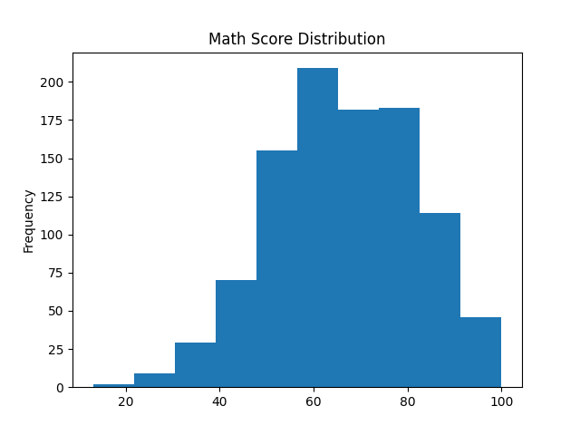
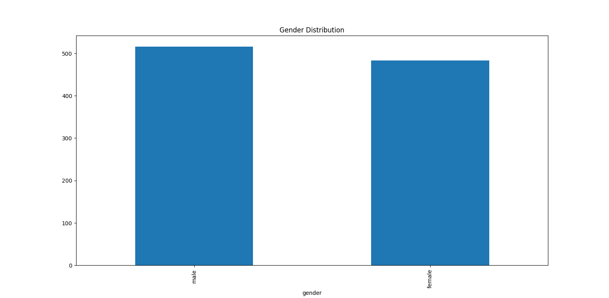
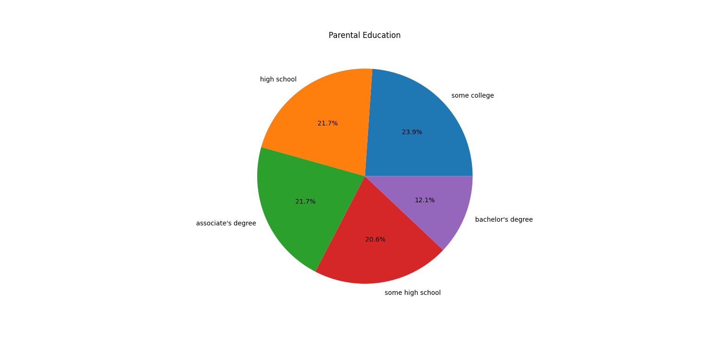

# Data Cleaning and Visualization Project

## Objective
The objective of this project is to clean, process, and visualize a student performance dataset using Python. The project demonstrates basic data preprocessing techniques and data visualization methods to generate meaningful insights.

## Tools Used
- Python
- Pandas
- Matplotlib
- VS Code
- GitHub

## Dataset
Students Performance Dataset

## Data Cleaning Steps
- Loaded the dataset using Pandas
- Checked for missing values
- Removed duplicate records
- Verified dataset information and structure

## Visualizations
1. Gender Distribution
Bar chart showing the distribution of male and female students.

2. Math Score Distribution
Histogram showing the distribution of student math 

3. Parental Education Distribution
Pie chart showing different parental education levels.

## Findings
- The dataset contains student performance information.
- Gender distribution is relatively balanced.
- Most students scored within the middle range of math scores.
- Different parental education levels are represented in the dataset.
- The dataset was successfully cleaned and visualized.

## Output Images
Bar Chart

Histogram

Pie Chart

## Outcome
This project helped in understanding data cleaning, preprocessing, and visualization techniques using Python. It also improved practical knowledge of Pandas, Matplotlib, and GitHub for data analysis projects.
